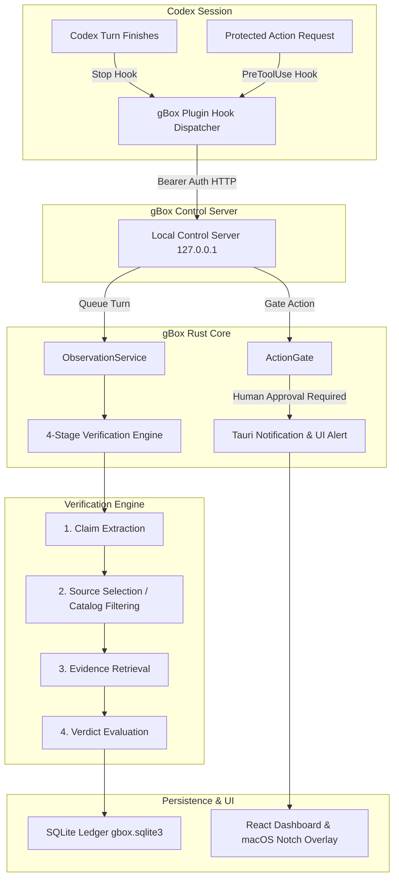

<p align="center">
  
</p>

<h1 align="center">gBox</h1>

<p align="center">
  Evidence and control for claims made by Codex.
</p>

gBox observes completed Codex research turns, extracts material claims, routes them to eligible read-only sources, and shows whether each claim is **Verified**, **Contradicted**, or **Unverifiable**. It is a macOS-first Tauri app with a local SQLite audit trail and one main native window, plus an optional camera-area notch overlay.

> [!NOTE]
> gBox observes the final assistant message delivered to a trusted Codex `Stop` hook. It does not read private reasoning or stream token-by-token thoughts.

## Table of contents

- [The demo in one minute](#the-demo-in-one-minute)
- [What is included](#what-is-included)
- [Quick start on macOS](#quick-start-on-macos)
- [Try the ordinary Codex flow](#try-the-ordinary-codex-flow)
- [Replay without Codex](#replay-without-codex)
- [Configure sources and observation](#configure-sources-and-observation)
- [Development checks](#development-checks)
- [Boundaries and removal](#boundaries-and-removal)

## The demo in one minute

1. A normal Codex session makes a claim.
2. The trusted hook queues the completed response and returns immediately.
3. gBox extracts and verifies claims in the background using configured MCP or web sources.
4. gBox sends one notification for the turn, prioritising contradictions and unresolved claims.
5. **Review in gBox** opens the matching dossier with the claim, source route, evidence, comparison, and failures.
6. A contradicted claim can be copied back to Codex as an evidence-backed correction prompt.

The included test also gates a fixed loopback webhook. Deny produces no delivery; approve produces one delivery and one hash-chained receipt.

## What is included

- Real Codex App Server integration for hosted sessions.
- A non-blocking global observation path through the `gbox-control` plugin.
- Generic claim extraction and source planning (MCP, web search, or configured plugins).
- A deterministic company-data MCP with seeded records for all three verdicts.
- Durable observation queue with restart recovery and transparent failures.
- Claim dossiers, native notifications, correction-copy handoff, and local receipts.
- A macOS notch around the camera area showing capture, verification progress, and new contradictions.
- Replay mode for judges who do not have Codex authentication or network access.



## Quick start on macOS

### Prerequisites

- macOS with Xcode Command Line Tools
- Stable Rust and Node.js 20+
- npm
- Codex CLI `0.144.4` or newer, authenticated with `codex login`

### Install and run

```bash
xcode-select --install # only if needed
codex --version
codex login
npm ci
npm run build:mcp
codex plugin marketplace add "$(pwd)/integrations/codex-marketplace"
codex plugin add gbox-control@gbox-local
npm run tauri dev
```

In Codex, open `/hooks`, review the `gbox-control` `PreToolUse`, `PostToolUse`, and `Stop` hooks, and trust them. In gBox **Settings**, enable **Global Codex observation**. Notification permission is requested only after this explicit opt-in; if permission is denied, results remain visible in the app.

> [!WARNING]
> The marketplace and company records are local demo assets. Do not place secrets directly in MCP JSON; use environment-variable references.

## Try the ordinary Codex flow

Open a normal Codex task outside gBox and send:

> Use this supplied internal research note as your only source: “Acme had 42 production database users in 2026-Q2.” Answer how many production database users Acme had in 2026-Q2 in one factual sentence. Do not call tools.

The seeded MCP reports `17`, so gBox should produce one **Contradicted** result and a notification. Select **Review in gBox**, inspect the dossier, then use **Copy correction for Codex** to prepare a correction for the original task. gBox never edits that task automatically.

## Replay without Codex

Open **Test tools** and choose **Deterministic replay**. Replay seeds one verified, one contradicted, and one unverifiable claim, then pauses at the real approval dialog.

- **Deny**: zero webhook deliveries.
- **Approve**: one loopback POST and one stored receipt.

Replay uses the same queue, verifier, approval gate, persistence, notification routing, and single-window UI as live observation.

## Configure sources and observation

In **Settings** you can:

- enable or disable global observation;
- independently enable **Launch gBox at login**;
- reuse existing Codex MCP configuration or add gBox stdio and Streamable HTTP MCP servers;
- choose cached, live, or disabled web search;
- inspect hook, App Server, MCP, notification, and notch status.

Only read-only, non-destructive tools are eligible for verification. See [Evidence routing and trust boundaries](docs/evidence-routing.md) for the source policy and [Core behavior and Codex integration iterations](docs/core-behavior-and-codex-integration-iterations.md) for the implementation history.

## Development checks

```bash
npm test
npm run build
cargo fmt --manifest-path src-tauri/Cargo.toml -- --check
cargo clippy --manifest-path src-tauri/Cargo.toml -- -D warnings
cargo test --manifest-path src-tauri/Cargo.toml
npm run check:repo
npm run tauri build
```

For the optional authenticated App Server integration test:

```bash
GBOX_LIVE_CODEX_TEST=1 npm test
```

The unsigned app is written to `src-tauri/target/release/bundle/macos/gbox.app`. If macOS blocks it, Control-click the app in Finder and choose **Open**; do not disable Gatekeeper globally. Local state is stored at `~/Library/Application Support/xyz.mcxross.gbox/gbox.sqlite3`.

## Boundaries and removal

gBox covers local Codex surfaces running trusted hooks and cannot backfill turns completed while it was stopped. V1 governs only the bundled loopback test webhook; the company MCP uses synthetic records, and receipts are locally hash-chained rather than externally notarized.

To remove the demo integration:

```bash
codex plugin remove gbox-control@gbox-local
codex plugin marketplace remove gbox-local
```
