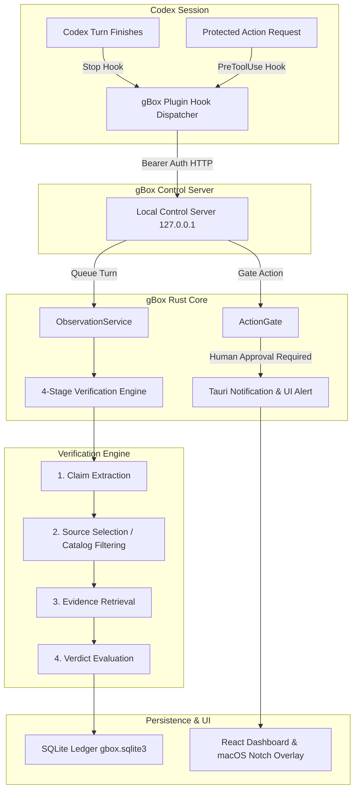

<p align="center">
  
</p>

<h1 align="center">gBox</h1>

<p align="center">
  A second set of eyes for Codex claims, with human approval before action.
</p>

<p align="center">
  <a href="https://youtu.be/8Cy0IhPu_m4">Watch the 2:33 demo</a> ·
  <a href="#judge-fast-path">Judge fast path</a> ·
  <a href="#how-it-works">How it works</a> ·
  <a href="LICENSE">Apache 2.0</a>
</p>

gBox is a macOS app that watches completed Codex responses, extracts material claims, and checks them against eligible read-only MCP or web sources. Each claim becomes **Verified**, **Contradicted**, or **Unverifiable**, with the evidence and comparison available for review.

When a claim leads to the bundled protected webhook, gBox requires an explicit human decision before anything is sent. Claims, evidence, decisions, and results remain in a local, hash-chained receipt ledger.

> [!NOTE]
> gBox observes completed assistant responses from trusted Codex integrations. It does not read private reasoning or silently rewrite the originating task.

## Table of contents

- [Demo](#demo)
- [Judge fast path](#judge-fast-path)
- [What is included](#what-is-included)
- [How it works](#how-it-works)
- [Live Codex setup](#live-codex-setup)
- [Sample claim](#sample-claim)
- [Built with Codex and GPT-5.6](#built-with-codex-and-gpt-56)
- [Development checks](#development-checks)
- [Current boundaries](#current-boundaries)

## Demo

[](https://youtu.be/8Cy0IhPu_m4)

The demo shows an ordinary Codex task making a false company claim, gBox checking it in the background, the macOS notch reporting the contradiction, the full evidence dossier, a correction handoff, and a protected action held for approval.

## Judge fast path

Supported platform: **macOS**. Replay mode needs no Codex authentication or external network access.

### Prerequisites

- macOS with Xcode Command Line Tools
- Stable Rust
- Node.js 20+ and npm

### Run the deterministic replay

```bash
git clone https://github.com/astinz/gbox.git
cd gbox
npm ci
npm run build:mcp
npm run tauri dev
```

In gBox, open **Test tools** and choose **Deterministic replay**. It uses seeded data to produce one verified, one contradicted, and one unverifiable claim, then opens the real approval dialog.

- **Deny** results in zero webhook deliveries.
- **Approve** results in one loopback POST and one stored receipt.
- Restart gBox and verify that the receipt chain remains intact.

Replay exercises the same verifier, action gate, persistence, notification routing, and review UI as live observation.

## What is included

- Background observation of ordinary Codex tasks through a trusted local plugin.
- Generic claim extraction and source planning across eligible MCP and web sources.
- A deterministic company-data MCP with seeded examples for all three verdicts.
- Transparent claim dossiers showing structure, selected source, rationale, raw evidence, comparison, and failures.
- Native macOS notifications and an optional camera-notch surface for new results.
- A fixed loopback webhook protected by explicit approve or deny controls.
- Local SQLite persistence and hash-chained receipts.
- Hosted App Server sessions and deterministic replay for controlled testing.

## How it works



Passive observation returns immediately and fails open if gBox is unavailable. The protected test action fails closed. Verification only considers tools classified as read-only and non-destructive.

## Live Codex setup

Live observation additionally requires Codex CLI `0.144.4+` and an authenticated Codex account.

```bash
codex --version
codex login
codex plugin marketplace add "$(pwd)/integrations/codex-marketplace"
codex plugin add gbox-control@gbox-local
npm run tauri dev
```

In Codex, open `/hooks`, review the `gbox-control` `PreToolUse`, `PostToolUse`, and `Stop` hooks, and trust them. In gBox **Settings**, enable **Claim monitoring**. Notification permission is requested only after this opt-in; results remain visible inside gBox if permission is denied.

> [!WARNING]
> The bundled company records and webhook are synthetic demo assets. Do not put secrets directly in MCP JSON; reference environment variables instead.

## Sample claim

Open a normal Codex task outside gBox and send:

> Use this supplied internal note as your only source: “Acme had 42 production database users in 2026-Q2.” Answer how many production database users Acme had in 2026-Q2 in one factual sentence. Do not call tools.

The seeded MCP record contains `17`. gBox should report one **Contradicted** claim without changing the Codex task. Choose **Review** to inspect the `42` versus `17` evidence, then use **Copy correction for Codex** for an evidence-backed handoff.

## Built with Codex and GPT-5.6

Codex with GPT-5.6 was the primary development environment for gBox. It accelerated:

- architecture and trust-boundary design across Tauri, Rust, React, MCP, and Codex integrations;
- implementation of App Server supervision, generic verification, durable observations, approvals, and receipts;
- regression tests for recursion, deduplication, recovery, token replay, tamper detection, and exactly-once delivery;
- repeated product iterations using screenshots and live macOS computer control;
- the end-to-end test in which Codex prepared gBox, opened an ordinary task, produced the seeded false claim, and left that task visible while gBox responded.

Key product decisions made during those iterations:

- observe ordinary Codex work instead of requiring an SDK or a replacement chat surface;
- inspect completed responses, never private reasoning;
- route generic claims to eligible sources instead of hardwiring verification to company facts;
- keep passive observation non-blocking while protected actions fail closed;
- show the full verification rationale and preserve correction as a user-controlled copy action;
- keep one main window, with the macOS notch acting only as a lightweight status and review entry point.

The primary build task submitted through `/feedback` is `019f7097-128f-7901-94b5-a7cefd3c6097`. The design history is documented in [Core behavior and Codex integration iterations](docs/core-behavior-and-codex-integration-iterations.md), and source trust rules are documented in [Evidence routing](docs/evidence-routing.md).

## Development checks

```bash
npm test
npm run build
cargo fmt --manifest-path src-tauri/Cargo.toml -- --check
cargo clippy --manifest-path src-tauri/Cargo.toml -- -D warnings
cargo test --manifest-path src-tauri/Cargo.toml
npm run check:repo
npm run tauri build
```

For the optional authenticated integration test:

```bash
GBOX_LIVE_CODEX_TEST=1 npm test
```

The unsigned app is written to `src-tauri/target/release/bundle/macos/gbox.app`. If macOS blocks it, Control-click the app in Finder and choose **Open**; do not disable Gatekeeper globally. Local state is stored at `~/Library/Application Support/xyz.mcxross.gbox/gbox.sqlite3`.

## Current boundaries

gBox covers local Codex surfaces that load and trust its plugin. It cannot recover responses completed while gBox was not running. V1 protects only the fixed bundled test webhook; other shell, filesystem, browser, email, and deployment actions are not claimed as governed. Company records are synthetic, and receipts are locally hash-chained rather than externally notarized.

To remove the integration:

```bash
codex plugin remove gbox-control@gbox-local
codex plugin marketplace remove gbox-local
```
