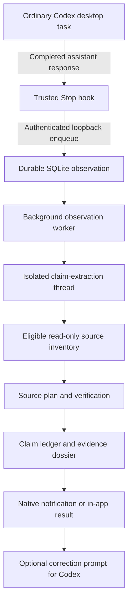

# Core Behavior and Codex Integration Iterations

This document records how gBox's core behavior and Codex integration evolved. It is an implementation history, not a replacement for the judge setup in the [README](../README.md) or the trust model in [Evidence Routing](evidence-routing.md).

Last validated: 2026-07-21.

## Current behavior in one flow

The primary product flow now begins in an ordinary Codex desktop task. gBox observes the completed response without replacing, blocking, or rewriting the originating task.



The Stop hook sees the final assistant response after a turn completes. It does not expose private chain-of-thought or provide token-by-token observation. gBox's internal extraction and verification threads have hooks disabled and are also excluded by an internal-session registry, preventing recursive observations.

## Iteration history

### 1. Tauri and shadcn foundation

The repository began as a Rust/Tauri scaffold and then gained a minimal shadcn-based React surface. Repository rules established the source-file size limit, separation of concerns, Rust and TypeScript formatting, and the prohibition on Go artifacts.

Relevant commits:

- `8e1f552` — initial Rust scaffold
- `3bb6aa5` — repository agent guidelines
- `a20d8d1` — rudimentary shadcn surface

At this stage, the application was a UI shell rather than an evidence-control system.

### 2. Minimum credible evidence-and-control loop

The first end-to-end gBox implementation added:

- A real `codex app-server --stdio` child process using JSONL request correlation and streamed notifications.
- Hosted Codex tasks with genuine thread, turn, assistant-message, tool, and MCP events.
- Structured extraction of company-metric claims.
- A seeded company-data MCP tool that returned deterministic synthetic records.
- `Verified`, `Contradicted`, and `Unverifiable` verdicts.
- A protected loopback webhook requiring an explicit approve or deny decision.
- SQLite persistence for claims, evidence, actions, decisions, deliveries, and hash-chained receipts.
- Deterministic replay for judging without Codex authentication or external networking.

Commit `37da459` established this minimum credible implementation.

The company-data contract was intentionally narrow. It gave the verifier one authoritative source and made all three outcomes repeatable, but it was not a sufficient general claim-verification model.

### 3. Generic claims and evidence routing

The next iteration removed the assumption that every claim was a company metric. Claims became generic structured assertions with fields such as:

- Statement and exact source span
- Claim type
- Subject, predicate, and object
- Asserted value and unit
- Temporal and geographic context

Verification became a routing problem:

1. Discover eligible read-only MCP and web-search sources.
2. Select a constrained source plan with explicit arguments and rationale.
3. Execute the selected source.
4. Apply a deterministic adapter where one exists, or preserve a transparent unverifiable result.
5. Store the source inventory, plan, result, comparison method, and failures.

gBox can inherit existing Codex MCP and plugin configuration or use additional gBox-specific stdio and Streamable HTTP MCP servers. Only tools classified as read-only and non-destructive are eligible for claim verification.

Relevant commits:

- `efaf92d` — generic claim model and evidence abstraction
- `ab6d5ec` — configurable MCP and web-search routing
- `9e33a5d` — routing and trust-boundary documentation

The synthetic company-data MCP remains as the deterministic test adapter. It is now one source among the eligible inventory rather than the definition of a claim.

### 4. Verification transparency and trust hardening

A verifier that returns only a colored verdict is difficult to trust. The claim dossier was expanded to show:

- The extracted claim structure and exact source span
- Sources eligible at decision time
- The selected plan and planned arguments
- The routing rationale
- Raw stored evidence and its SHA-256 hash
- The comparison method
- Prior source and verification failures

The implementation also hardened malformed planner output, source failures, unit comparison, structured MCP results, and persistence of decision traces.

Relevant commits:

- `5954f52` — verification decision trails
- `695ba53` — trustworthy trace and failure handling

This iteration changed the UI from a verdict display into an inspectable audit surface.

### 5. Single-window UI and observable hosted activity

The application moved to one primary native Tauri window. Secondary application surfaces use reusable dialogs, while system-wide controls live on a dedicated Settings screen. The dashboard shows only the current observation posture, recent results, and entry points to deeper records.

Hosted Codex tasks gained live progress based on public App Server events: connection, turn state, assistant-message deltas, MCP calls, and tool activity. The UI explicitly avoids presenting private reasoning as though it were available.

Relevant commits:

- `f15730a` — single-window screen flow
- `27afb7f` — observable Codex activity

The reusable dialog later gained a constrained middle row and shared shadcn `ScrollArea`, fixing long dossiers that were clipped and could not be scrolled.

On macOS, an optional non-focusable observation notch is the sole auxiliary surface. It is anchored around the camera notch, expands downward when Codex output is captured or verified, and opens the existing main window for review rather than duplicating the dossier.

### 6. Ordinary Codex observation became the primary flow

Hosted tasks provide complete event visibility, but they require users to start work inside gBox. The product direction shifted toward observing ordinary Codex research tasks.

The trusted plugin's `Stop` hook now sends the completed assistant message to gBox's authenticated loopback control service. Ingestion is asynchronous and fail-open:

- The hook validates and enqueues the response, then returns immediately.
- SQLite deduplicates repeated deliveries by session, turn, and message hash.
- A background worker extracts and verifies observations in FIFO order.
- Pending work survives app restarts; stale processing work is recovered.
- Infrastructure or extraction failures retry once; source failures remain visible as `Unverifiable` evidence.
- Repeated claims with unchanged verdicts in one session can suppress duplicate notifications.

Internal recursion is prevented twice: internal App Server threads disable hooks, and hook payloads matching the internal-thread registry are rejected.

Relevant commits:

- `d139faf` — internal-hook recursion prevention
- `69d64fe` — durable observation queue and recovery
- `51c92d2` — notifications and launch-at-login behavior
- `9ff35b8` — dashboard centered on ordinary Codex claim review

Observation is off by default. When enabled, gBox can start at login in the background. If native notification permission is unavailable, completed results remain visible in the application.

### 7. Correction handoff without session mutation

For a contradicted claim, the dossier can produce a correction prompt containing:

- The original claim
- Conflicting or authoritative evidence
- The source reference
- The comparison method
- An instruction to reconsider the earlier answer

The prompt is copied for the user to paste into Codex. gBox does not inject a new turn into an ordinary Codex task after its Stop hook returns. This keeps the originating conversation under user control and avoids pretending Codex exposes a safe asynchronous callback that it does not provide.

## Codex integration surfaces

gBox has four distinct Codex integration surfaces. Tests and product claims should name the surface being exercised.

| Surface | What gBox receives | Primary use | Blocking behavior |
| --- | --- | --- | --- |
| Hosted App Server session | Thread, turn, assistant-message, tool, and MCP events | Complete live task visibility | The user intentionally runs the task through gBox |
| Trusted `Stop` hook | Final assistant message plus session, turn, and working-directory identifiers | Background observation of ordinary Codex tasks | Fail-open; enqueue and return |
| Internal App Server threads | Structured extraction, source planning, and verification output | gBox's own analysis | Hooks disabled; read-only sandbox |
| Protected `PreToolUse` hook | Arguments for `gbox_send_test_webhook` | Human approval before the test side effect | Fail-closed on denial, timeout, or unavailable gBox |

The `PostToolUse` hook reports the protected action's result. The test webhook accepts no arbitrary destination and requires a short-lived, single-use permit bound to the action and payload hash.

## What the desktop integration test corrected

Early integration checks proved useful pieces but did not prove the complete desktop experience:

- Direct loopback Stop-hook payloads proved validation, deduplication, queueing, and verdict behavior.
- `codex exec` proved a real Codex hook could reach gBox.
- Neither test proved that a normal task remained visible in the Codex desktop application while gBox observed it.

The corrected test created a normal Codex desktop task titled **Report Acme database users**. Its completed response was:

> Acme had 42 production database users in 2026-Q2.

The originating task remained intact and idle in Codex. gBox stored an observation with the same Codex session and turn identifiers, processed it from `Pending` to `Processing` to `Completed`, selected `company_data/company_get_metric`, and returned `Contradicted` because the authoritative synthetic record contains `17`, not `42`.

This is the current reference test for the ordinary Codex observation path.

## Findings from real use

### FIFO latency is visible

During the corrected desktop test, a longer completed response containing six extracted claims was ahead of the false Acme claim. Because the observation worker is deliberately FIFO and processes one observation at a time, the short contradiction waited for the earlier response.

The queue preserved correctness and ordering, but the delay is a real product concern. Likely next iterations include bounded concurrency, per-session ordering, claim-count budgets, or priority for short and high-risk observations.

### Test data can be mistaken for user activity

Synthetic Stop payloads and replay data appear in the same local dashboard unless clearly labeled or reset. Older `Unverifiable` rows can also outlive a verifier fix. Judge and developer workflows should distinguish replay, synthetic hooks, hosted App Server tasks, and ordinary desktop tasks.

### Long dialogs require a constrained scroll region

A maximum dialog height alone did not make dossier contents scrollable. The reusable dialog now uses a fixed header, a `minmax(0, 1fr)` content row, a shared scroll area, and an optional fixed footer. The native Tauri regression check confirmed scrolling from extracted structure through evidence and failure history.

### Readiness and delivery need explicit status

Global observation can be operational while hook-trust readiness is still reported conservatively, and macOS notification permission can be unavailable while in-app delivery continues. The UI exposes these states separately rather than equating observation, hook trust, and native notification delivery.

### The macOS notch must use the physical screen frame

The first notch pass had the right visual silhouette but used Tauri's ordinary window coordinates. macOS consequently kept it in the safe window zone below the menu bar. The corrected implementation configures the auxiliary surface through AppKit and positions it against the full `NSScreen.frame`, not `visibleFrame`.

The compact surface is centered across the physical camera area, sits above the main-menu window level, and remains stationary across Spaces. Its closed width and height are derived from `auxiliaryTopLeftArea`, `auxiliaryTopRightArea`, and `safeAreaInsets`; a small margin supplies a reachable pointer target around the otherwise non-interactive camera cutout. The shell is pure black so it visually merges with the camera housing.

Pointer entry has a short intent delay and pointer exit has a grace period, preventing resize flicker. Because the physical camera cutout is not a normal webview hit-test region, AppKit samples the native pointer position and emits hover transitions for a narrow target extending beside and below the camera. Native AppKit frame animation smooths expansion and collapse. Hovering while idle identifies old evidence explicitly as the latest result instead of presenting it as a newly completed check. This is an optional auxiliary surface; the main application remains a single standard window and all dossiers and settings still open there.

The automatic reveal policy was later narrowed after packaged testing exposed a stuck-open state. Queueing and checking remain compact, as do verified, unverifiable, and failed results. The expanded card now appears only while the pointer is within the notch or for six seconds after a newly completed contradiction. Pointer exit collapses a hover preview, and opening the main gBox window clears both hover and automatic-reveal state before showing the dashboard.

## Current boundaries

The current implementation deliberately does not claim:

- Universal interception of every agent or network request on the machine
- Access to private model reasoning
- Observation of turns completed while gBox was not running
- Automatic correction of an ordinary Codex conversation
- Governance of shell, filesystem, browser, deployment, or email actions
- Production company data or production credential management
- External notarization of the local receipt chain
- Reliable verification when no eligible trustworthy source exists

Global coverage applies to local Codex surfaces that load and trust the gBox plugin hooks. Only the bundled loopback test webhook is protected in this version.

## Code map

- `src-tauri/src/codex.rs` and `src-tauri/src/codex/` — App Server lifecycle, extraction, ingestion, verification, and protocol tests
- `src-tauri/src/evidence.rs` — evidence-source configuration and eligibility
- `src-tauri/src/observation.rs` — background worker and retry behavior
- `src-tauri/src/control.rs` — authenticated loopback hook service
- `src-tauri/src/gate.rs` — protected-action approval gate
- `src-tauri/src/store/` — SQLite schema, observations, persistence, and tests
- `integrations/codex-marketplace/plugins/gbox-control/` — Codex hooks and bundled MCP server
- `src/components/claim-detail.tsx` — verification dossier
- `src/components/dashboard-overview.tsx` — observation-first dashboard
- `src/components/app-dialog.tsx` — reusable single-window dialog behavior
- `src/components/observation-notch.tsx` — macOS capture and verdict notch
- `src-tauri/src/notch.rs` — macOS-only notch window lifecycle and positioning
- `src/hooks/use-observation-notifications.ts` — notification delivery and routing

## Validation baseline

The repository checks cover frontend behavior, MCP integration, App Server parsing, claim extraction, evidence routing, deterministic verdicts, observation deduplication and recovery, permit safety, receipt integrity, and source-file rules.

The required baseline remains:

```bash
npm test
npm run build
cargo fmt --manifest-path src-tauri/Cargo.toml -- --check
cargo clippy --manifest-path src-tauri/Cargo.toml -- -D warnings
cargo test --manifest-path src-tauri/Cargo.toml
npm run check:repo
npm run tauri build
```

The most recent local validation included 36 passing frontend tests, 33 passing Rust tests, a successful production build, repository source checks, a successful unsigned macOS bundle, a manual native scroll regression check, and a packaged camera-notch capture check.
